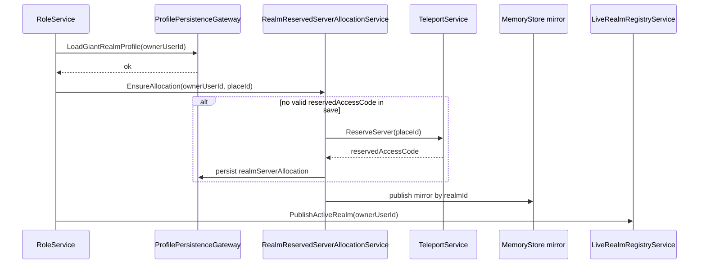
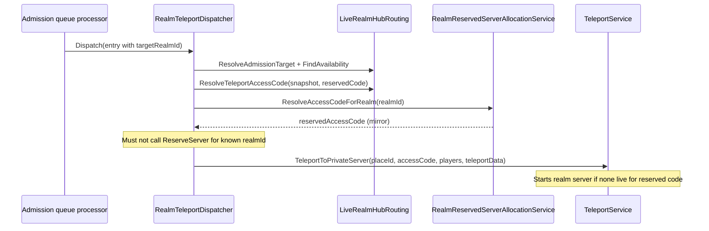

# TIN-104 Reserved Giant Realm Server Allocation — Kickoff

**Date:** 2026-06-15  
**Issue:** [TIN-104](https://linear.app/spectranoir/issue/TIN-104/implement-reserved-giant-realm-server-allocation)  
**Milestone:** Admission and Queueing  
**Related:** [TIN-49](https://linear.app/spectranoir/issue/TIN-49) (architecture), [TIN-105](https://linear.app/spectranoir/issue/TIN-105) (live registry), [TIN-106](https://linear.app/spectranoir/issue/TIN-106) (handoff tokens), [TIN-117](https://linear.app/spectranoir/issue/TIN-117) (admission queue), [TIN-59](https://linear.app/spectranoir/issue/TIN-59) (raid-board UX; blocked on this slice), [TIN-107](https://linear.app/spectranoir/issue/TIN-107) (published-client teleport evidence)

## Goal

Close the admission→teleport gap for Giant realms that advertise through the live registry but do not have a live `privateServerId` access code. Allocate **one durable reserved-server access code per `realmId`**, persist it, and use it for all hub-side `TeleportToPrivateServer` routing — including **cold start** when no live realm server is running.

## Problem statement (current behavior)

| Step | Today | Failure |
|---|---|---|
| Registry availability | Public realm may list `privateServerId = giant_realm_ps_{ownerUserId}` (stable placeholder) | Placeholder is **not** a Roblox reserved access code |
| `LiveRealmHubRouting.ResolveTeleportAccessCode` | Returns code only for `accessMode == private` with a **non-fallback** live id | Returns `nil` for public + stable fallback |
| `RealmTeleportDispatcher` | Falls through to `TeleportService:ReserveServer(placeId)` | Spawns an **unrelated** ephemeral server, not the target Giant realm |

Evidence: `tests/live_realm_hub_routing.spec.luau` asserts public stable fallback does not resolve a teleport access code; dispatcher tests expect `ReserveServer` when registry path fails.

## Slice boundary (in scope)

### Shared (pure)

- `RealmReservedServerAllocationState` — validate allocation record, idempotent ensure rules, encode/decode.
  - Record fields: `realmId`, `ownerUserId`, `reservedAccessCode`, `destinationPlaceId`, `allocatedAt`, `allocationVersion`.
  - Distinguish **stable placeholder** (`giant_realm_ps_*`) from **real reserved access code** (Roblox `ReserveServer` output).
- Extend `LiveRealmHubRouting`:
  - `ResolveTeleportAccessCode(snapshot, reservedAccessCode?)` — resolution order:
    1. Live registry `privateServerId` when present and **not** stable fallback.
    2. Else durable `reservedAccessCode` when valid.
    3. Else `nil` (caller must not `ReserveServer` for a known `targetRealmId`).
  - Keep `IsStablePrivateServerFallback` unchanged (still identifies placeholder ids).

### Durable persistence (Giant realm profile)

- Add optional `realmServerAllocation` block to `GiantRealmSaveSchema.GiantRealmSaveRoot`:
  - `reservedAccessCode: string`
  - `destinationPlaceId: number`
  - `allocatedAt: number`
- Serialize/deserialize through existing `GiantBuildModeService` save snapshot path (same pattern as `giantLevelPersistence`).
- **Source of truth** for which access code belongs to a realm across restarts.

### Ephemeral hub read mirror (MemoryStore)

- `MemoryStoreStructurePolicy.realmReservedServerAllocation` — `HashMap`, key `realmId`, long TTL (match `giantLevelPendingXp` / `realmTradeConversionPending` ceiling).
- `RealmReservedServerAllocationStore` — publish/read/prune adapter seam (in-memory fallback for tests).
- Published whenever allocation is created or reaffirmed on Giant realm profile load/save.
- Hub servers read mirror **without** loading the full Giant realm profile.

### Server orchestration

- `RealmReservedServerAllocationService` + bootstrap:
  - `EnsureAllocation(input)` — if profile has no valid code, call injected `TeleportService:ReserveServer(destinationPlaceId)` once, persist to profile + MemoryStore mirror.
  - `ResolveAccessCodeForRealm(realmId)` — read mirror (fallback: none in this slice; no profile peek gateway).
  - `GetAllocationDiagnostics` / `_RealmReservedServerAllocationService_QueryAPI`.
- Wire `EnsureAllocation` from Giant realm profile load path (`RoleService` after successful `LoadGiantRealmProfile`).
- Wire mirror publish on ensure + on realm save boundary when allocation present.

### Teleport routing integration

- `RealmTeleportDispatcher.resolveRegistryTeleportAccessCode`:
  - After hub admission accepts `targetRealmId`, resolve access code via extended `LiveRealmHubRouting.ResolveTeleportAccessCode` + `ResolveAccessCodeForRealm`.
  - **Remove** `ReserveServer` fallback when `targetRealmId` is known and resolution fails; return `target_private_server_unresolved` (retryable).
  - `ReserveServer` remains acceptable only for explicitly unscoped/test dispatch paths without a `targetRealmId` (none in production queue flow).
- `LiveRealmRegistryService` heartbeat: when publishing, prefer runtime `game.PrivateServerId` when on reserved server; otherwise publish stored allocation code instead of stable placeholder when allocation exists.

### Entry validation (bounded)

Before dispatch, validate:

| Check | Rule |
|---|---|
| `realmId` / owner | `targetRealmId` matches `giant_realm_{ownerUserId}` derived owner |
| Access code | Resolved via registry live id **or** durable/mirror allocation |
| Access mode × entry type (prototype) | `standard` queue entry → target `accessMode == public`; `direct_invite` / `rescue_contract` → existing admission paths unchanged |
| Handoff | Existing TIN-106 `BeginCrossServerHandoff` unchanged |

Full permission matrix UI (TIN-55) is out of scope; enforce only what registry + queue already encode.

## Out of scope / deferred

- TIN-55 owner-facing permission settings and friends-only / raid-enabled modes.
- Hub-side lazy allocation when Giant has **never** loaded a profile (`reserved_server_unallocated` until first Giant realm load).
- `TeleportAsync` / public-server join (non-reserved) semantics.
- Cross-place destination resolver expansion beyond current `destinationPlaceId` config seam.
- Client-visible access codes or TeleportData secrets.
- Published-client evidence run (TIN-107) — note follow-up checklist item only.
- TIN-59 raid-board UI (downstream consumer).

## Architecture alignment (TIN-49)

| Concept | Treatment |
|---|---|
| `realmId` | Durable coordination identity (`giant_realm_{ownerUserId}`) |
| `PrivateServerId` / reserved access code | Stable join identity for a realm; **not** `JobId` |
| `JobId` | Ephemeral; live registry only |
| `giant_realm_ps_*` | Placeholder label when no live or allocated code is known — **never** teleported to |
| Persistence tier | Allocation record in **Durable Giant realm profile**; mirror in **Ephemeral cross-server** for hub reads |

## Data contracts

### Durable allocation record (`realmServerAllocation`)

```lua
{
  reservedAccessCode: string, -- Roblox ReserveServer output; safe encoded segment
  destinationPlaceId: number, -- positive integer
  allocatedAt: number,        -- unix or os.clock per existing save conventions
}
```

### MemoryStore mirror payload

```lua
{
  encodeVersion: "v1",
  realmId: string,
  ownerUserId: number,
  reservedAccessCode: string,
  destinationPlaceId: number,
  allocatedAt: number,
  updatedAt: number,
}
```

### Access-code resolution result (internal)

```lua
{
  accepted: boolean,
  reason: string, -- accepted | target_realm_unavailable | reserved_server_unallocated | target_private_server_unresolved
  accessCode: string?,
  resolverPath: string, -- live_registry | durable_allocation | unresolved
}
```

## Key flows

### A. Giant first realm load (allocation)



### B. Hub admission dispatch (join / cold start)



## Key files to inspect first

| Area | Path |
|---|---|
| Placeholder vs live id | `src/ReplicatedStorage/Shared/GiantRealm/LiveRealmRegistryState.luau` |
| Hub routing / access code | `src/ReplicatedStorage/Shared/GiantRealm/LiveRealmHubRouting.luau` |
| Teleport dispatch fallback | `src/ServerScriptService/Services/RealmTeleportDispatcher.luau` |
| Registry publish/heartbeat | `src/ServerScriptService/Services/LiveRealmRegistryService.luau` |
| Giant load hook | `src/ServerScriptService/Services/RoleService.server.luau` |
| Save schema | `src/ReplicatedStorage/Shared/GiantRealm/GiantRealmSaveSchema.luau` |
| MemoryStore policy pattern | `src/ServerScriptService/Services/MemoryStoreStructurePolicy.luau` |
| Pending-buffer precedent | `src/ServerScriptService/Services/GiantLevelPendingXpStore.luau` |
| Admission entry types | `src/ReplicatedStorage/Shared/GiantRealm/RealmAdmissionQueueState.luau` |
| Tests | `tests/live_realm_hub_routing.spec.luau`, `tests/realm_teleport_dispatcher_runtime_entrypoint.spec.luau` |

## Acceptance criteria mapping (TIN-104)

| Linear criterion | Plan |
|---|---|
| Giant realm can reserve a server access code | `EnsureAllocation` + `ReserveServer` on first load when missing |
| Reserved server code stored against realmId | `GiantRealmSaveRoot.realmServerAllocation` + MemoryStore mirror keyed by `realmId` |
| Realm entry uses reserved access code via TeleportOptions | `TeleportToPrivateServer(placeId, accessCode, …)` with resolved code |
| Server validates owner, realmId, access mode, entry type | Bounded checks in dispatcher/allocation service before teleport |
| No live server → access code can start one | Teleport to durable reserved code without `ReserveServer` per join |

## Validation

```powershell
.\scripts\run-validation.ps1 -ChangedOnly
lune run tests/realm_reserved_server_allocation_state.spec.luau
lune run tests/realm_reserved_server_allocation_service_runtime_entrypoint.spec.luau
lune run tests/live_realm_hub_routing.spec.luau
lune run tests/realm_teleport_dispatcher_runtime_entrypoint.spec.luau
lune run tests/live_realm_registry_*.spec.luau
lune run tests/giant_realm_save_schema.spec.luau
lune run tests/memorystore_structure_policy.spec.luau
.\scripts\run-tests.ps1
```

### Required test scenarios

- Public availability snapshot with stable fallback + mirror allocation → `ResolveTeleportAccessCode` returns durable code.
- Live registry non-fallback `privateServerId` takes precedence over mirror.
- Dispatcher with known `targetRealmId` never calls `ReserveServer` on resolution failure.
- Dispatcher uses mirror code for public stable-fallback registry row.
- `EnsureAllocation` idempotent when save already contains valid code.
- Save schema round-trip for `realmServerAllocation`.
- Access-mode × `standard` entry rejection when target is non-public (prototype rule).

## Risks

| Risk | Mitigation |
|---|---|
| Hub join before Giant ever loads profile | Explicit `reserved_server_unallocated` failure; document until TIN-54/default-realm bootstrap expands |
| `ReserveServer` quota / publish-only API | Inject teleport service; fail closed with diagnostics; TIN-107 published proof |
| Mirror/profile drift | Publish mirror on every ensure + save; mirror is read-only cache |
| Re-allocating codes on every load | Idempotent ensure; only allocate when save field missing/invalid |
| Exposing access codes to clients | Server-only resolution; registry hub listings remain client-safe (TIN-59) |

## Downstream unlock

- **TIN-59 Slice A** raid-board queue can ship after this merges.
- Admission queue + handoff path unchanged; only teleport access-code resolution becomes correct.

## Follow-up (not this slice)

- TIN-107 published-client evidence for cold-start join and return.
- TIN-55 permission matrix enforcement beyond prototype `accessMode` checks.
- Optional hub-side allocation bootstrap for never-visited Giants (needs product decision).
