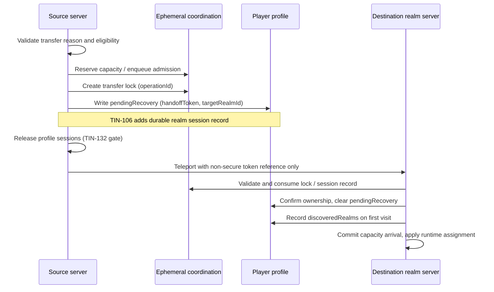

# TIN-49 Persistent Realm Architecture

## Status

- Issue: [TIN-49](https://linear.app/spectranoir/issue/TIN-49/define-persistent-realm-architecture)
- Milestone: Persistence and Ownership
- Slice type: architecture definition only
- This document is the canonical architecture contract for shared-world vs Giant-realm topology, persistence partitions, controlled transfer, and player location category.

This slice does not implement cross-server transfer runtime, handoff tokens, or new save-pipeline behavior.

## Scope markers

- **Current prototype:** single-place playtest with server-authoritative role selection, in-session realm simulation, and partial cross-server coordination seams (admission queue, teleport handoff, profile gateway).
- **Long-term direction:** separate shared Tinyfolk hub servers and per-Giant persistent realm servers connected by controlled transfer.

## World topology

Tinyfolk: Realm of Giants uses two durable world categories:

| World category | Primary actors | Default spawn | Durable owner |
|---|---|---|---|
| **Shared Tinyfolk hub** | Tinyfolk social/economic play | Tinyfolk players without an active realm assignment | No per-player realm profile |
| **Giant personal realm** | Giant ruler + visiting Tinyfolk | Giant owner on their realm server | One `GiantRealmProfile` per Giant owner |

Directional flows (from `docs/GAME_SPEC.md`):

- Capture moves Tinyfolk from the shared hub into a Giant realm.
- Escape returns Tinyfolk from a Giant realm to the shared hub.
- Trade between Giant realms is future scope and uses the same controlled-transfer shell as capture/rescue.

## Server categories

Roblox deployment is modeled as two server kinds sharing one codebase:

1. **Shared hub server**
   - Hosts the shared Tinyfolk world layer.
   - Tinyfolk spawn here when `locationCategory = shared_hub`.
   - Giants may visit for matchmaking or social surfaces, but do not own durable realm state on this server.
   - Safe-zone policy treats the hub as `SharedHub` (no capture in hub safe zones).

2. **Giant realm server**
   - Hosts one Giant owner's persistent realm instance.
   - The active Giant owner loads `GiantRealmProfile:{ownerUserId}` through `ProfilePersistenceGateway`.
   - Visiting Tinyfolk arrive only through a validated controlled transfer (capture, rescue, trade, or party admission).
   - `RoleService` projects `GiantRealmOwnerUserId` after a successful Giant realm profile load.

**Prototype note:** the current repository runs both categories in one Studio place for bounded vertical-slice validation. The architecture above is the target production split; prototype code may colocate hub and realm surfaces without changing the durable ownership model.

## Identity and keys

| Concept | Canonical key / id | Owner |
|---|---|---|
| Player profile | `PlayerProfile:{userId}` | Individual player |
| Giant realm profile | `GiantRealmProfile:{ownerUserId}` | Giant owner (`ownerUserId`) |
| Realm id (coordination) | `giant_realm_{ownerUserId}` | Derived from Giant owner user id |
| Transfer operation | `operationId` (admission / handoff) | Ephemeral cross-server coordination |
| Handoff token | Short-lived opaque reference | Ephemeral; validated server-side on arrival |

Realm id is a coordination identifier, not a second durable profile root. Durable realm gameplay state lives in the Giant realm save root keyed by owner user id.

## Persistence tiers

Four tiers separate durability concerns. Gameplay systems must route writes to the correct tier.

### 1. Durable player profile

- **Store:** ProfileStore `TinyfolkPlayerProfiles` via `ProfilePersistenceGateway` / `ProfileStoreOwnerLayer`.
- **Scope:** player-owned fields that follow the player across servers.
- **Examples (implemented or reserved):** `rolePreference`, `specialistPreference`, `inventoryCraftState`, `skillsProfileState`, `escapeHistory`, `discoveredRealms`, `partyHistory`, `safeLocation`, `pendingRecovery`, `trophyDisplayPreference`.
- **Rule:** player profile never owns Giant realm structures, realm resource ledger, or realm trophy/level ladders.

### 2. Durable Giant realm profile

- **Store:** ProfileStore `TinyfolkGiantRealmProfiles` via the same gateway/owner layer.
- **Scope:** one save root per Giant owner, validated by `GiantRealmSaveSchema`.
- **Examples:** `placedStructures`, `shrinePersistence`, `rescuePersistence`, `resourceLedger`, `worksiteUpgrades`, `trophyPersistence`, `giantLevelPersistence`, `giantReputationPersistence`, `emergencyReinforcement`, `defenseHistory`.
- **Rule:** realm profile is authoritative for realm layout, realm economy ledger, and realm-scoped event history. It does not store other players' personal preferences.

### 3. Ephemeral cross-server coordination

- **Store:** MemoryStore structures defined in `MemoryStoreStructurePolicy` (adapter-mediated; no raw `MemoryStoreService` from gameplay).
- **Scope:** live registry, admission queues, transfer locks, active capacity, idempotency, capture timers.
- **TTL:** short-lived by design; must not be the sole source of gameplay rights or rewards.
- **Rule:** coordination records may reference `realmId` and `operationId` but custody, inventory grants, and capture permissions resolve from server-side durable + runtime authority on arrival, not from TeleportData.

### 4. Session runtime

- **Store:** in-memory server state only.
- **Scope:** active capture/escape/defense/return participation, role lock, specialist assignment, session resource pools (produced/in-transit where not yet snapshotted), live score session totals.
- **Rule:** defined by `EventStateOwnershipModel` — capture and escape outcomes write session runtime only; defense and return may also write realm profile fields.

See also `docs/TIN-174_EVENT_STATE_OWNERSHIP_MODEL.md` and `docs/PROFILE_OWNERSHIP_DECISION.md`.

## Player profile vs realm profile relationship

| Concern | Player profile | Realm profile |
|---|---|---|
| Who owns it | The player | The Giant owner |
| Travels with player across servers | Yes | No (loaded on destination realm server) |
| Holds realm layout / structures | No | Yes |
| Holds player preferences / skills | Yes | No |
| Holds visit discovery / safe return | Yes | No |
| Holds realm trophies / reputation ladder | No | Yes |
| Holds active custody of a Tinyfolk | No (runtime + future session record) | Indirectly via realm-scoped rescue queue and defense history |

**Write authority:** gameplay services call `ProfilePersistenceGateway` only. Giant realm live state is snapshotted through `GiantBuildModeService.BuildSaveSnapshot` / `ApplySaveSnapshot` at save boundaries. No gameplay system writes raw `DataStoreService`.

## Player location category (global state)

The player profile records **where category of world** the player belongs to, not exact world coordinates.

### Canonical categories

| `locationCategory` | Meaning | Typical server kind |
|---|---|---|
| `shared_hub` | Player's durable assignment is the shared Tinyfolk hub | Shared hub server |
| `giant_realm` | Player is assigned to a specific Giant realm | Giant realm server for `realmOwnerUserId` |
| `transfer_in_flight` | Controlled transfer started; arrival not yet confirmed | Source or destination during handoff |

### Profile fields that implement location category today

| Field | Role in location model |
|---|---|
| `safeLocation` | Last confirmed safe return point; implies `shared_hub` after successful escape/safe return |
| `pendingRecovery` | `transfer_in_flight` with `targetRealmId`, `handoffToken`, `status` |
| `discoveredRealms` | Historical first-visit record; not live assignment |

### Derived location rules

1. If `pendingRecovery.status = awaiting_destination`, effective category is `transfer_in_flight`.
2. Else if the player is on a Giant realm server with a validated active assignment to `giant_realm_{ownerUserId}`, category is `giant_realm`.
3. Else category is `shared_hub`.

**Future consolidation (TIN-11):** introduce an explicit `realmAssignment` player-profile namespace with `{ locationCategory, realmId?, realmOwnerUserId?, assignmentReason?, updatedAt }` as the single server-owned assignment read model. Until TIN-11 ships, location category is derived from `safeLocation`, `pendingRecovery`, and live server context.

### Assignment reasons (transfer ingress)

Controlled transfer reasons that may set `giant_realm` assignment:

- `capture` — Giant capture flow into custodian realm
- `rescue` — rescuer admission to target realm
- `escape_return` — clears realm assignment back to `shared_hub`
- `trade` — future Tinyfolk trade between realms
- `party_admission` — grouped admission through realm admission queue

## Controlled transfer architecture

Tinyfolk enter a Giant realm only through a **controlled transfer** pipeline. No direct client-selected realm teleport.

### Security constraints (binding for downstream implementation)

- TeleportData carries only non-secure token reference and UI context.
- Custody rights, inventory grants, capture permissions, and rewards never travel in TeleportData.
- Arrival authority resolves from JoinData plus server-side records keyed by `realmId` / `operationId`.
- Invalid or expired handoff sends the player to a safe fallback (shared hub spawn).
- Duplicate transfer attempts fail safely when a live handoff lock exists.

### Prototype evidence (partial implementation)

| Stage | Current seam |
|---|---|
| Profile session load/save/release | `ProfilePersistenceGateway`, `ProfilePersistenceLifecycle` |
| Teleport-aware release gate | `ProfileTeleportHandoffService`, TIN-132 |
| Admission enqueue / processing | `RealmAdmissionQueueService`, `RescueAdmissionService`, `ProfileTeleportAdmissionService` |
| Transfer lock policy | `TransferLockService`, `MemoryStoreStructurePolicy.transferLocks` |
| Capacity reservation | `ActiveRealmCapacityService` |
| Destination arrival orchestration | `ProfileTeleportHandoffService.OrchestrateDestinationArrival` |
| Pending recovery persistence | `PendingRecoveryProfileState` |
| First-visit discovery | `DiscoveredRealmsProfileState` |

## Giant lifecycle on realm servers

1. Player selects Giant role (pre-spawn, session-locked).
2. Server loads `GiantRealmProfile:{userId}` when role locks in.
3. `ApplySaveSnapshot` hydrates realm structures, ledger, upgrades, and realm-scoped persistence namespaces.
4. Autosave and leave/shutdown paths call `BuildSaveSnapshot` then `SaveGiantRealmProfile`.
5. On leave, realm profile session releases to avoid cross-server lock contention.

Giants do not persist session Wood/Stone/Essence production pools to the realm ledger unless a future issue explicitly promotes session totals into durable ledger fields.

## Acceptance criteria mapping

| Criterion | Architecture answer |
|---|---|
| Tinyfolk spawn into shared public server | Default `locationCategory = shared_hub` on shared hub servers; `safeLocation.returnPointName` anchors safe return spawn |
| Each Giant has a persistent personal realm profile | `GiantRealmProfile:{ownerUserId}` with schema-valid save root |
| Realm state is separate from player profile state | Separate ProfileStore sessions, namespaces, and write paths (tables above) |
| Tinyfolk enter a Giant realm through controlled transfer | Admission queue + handoff gate + `pendingRecovery`; no direct client realm pick |
| Global state records current player location category | `shared_hub` / `giant_realm` / `transfer_in_flight` derived from profile fields; explicit `realmAssignment` deferred to TIN-11 |

## Downstream handoff (out of TIN-49 scope)

| Issue | Depends on TIN-49 | Delivers |
|---|---|---|
| [TIN-11](https://linear.app/spectranoir/issue/TIN-11/implement-realm-transfer-state-model) | Location categories, assignment reasons, transition shell | Server-owned `realmAssignment` state machine and debug surfaces |
| [TIN-106](https://linear.app/spectranoir/issue/TIN-106/implement-realm-transfer-handoff-tokens) | Transfer pipeline, security constraints, key model | Durable realm session record, short-lived handoff tokens, lock consume on arrival |
| [TIN-241](https://linear.app/spectranoir/issue/TIN-241/giant-level-cross-realm-xp-sync-and-trade-xp-source) | Realm vs player partition, realm id keying | Cross-realm XP sync policy |

Do not fold TIN-11 or TIN-106 implementation into architecture-only follow-ups.

## Related documents

- `docs/GAME_SPEC.md` — world model direction
- `docs/PROFILE_OWNERSHIP_DECISION.md` — gateway and ProfileStore ownership
- `docs/TIN-174_EVENT_STATE_OWNERSHIP_MODEL.md` — runtime vs durable event namespaces
- `docs/SYSTEM_BOUNDARIES.md` — Ephemeral Cross-Server Coordination and profile lifecycle status
- `docs/TIN-117_REALM_ADMISSION_QUEUE_CLOSURE_2026-05-25.md` — admission queue delivery
- `docs/TIN-67_CROSS_SERVER_TRANSFER_ORCHESTRATION_CLOSURE_2026-06-11.md` — destination orchestration
- `docs/TIN-75_ENFORCEMENT_SLICE_KICKOFF_2026-06-15.md` — recent capture/rescue enforcement context

## Runtime references

- `src/ServerScriptService/Services/ProfilePersistenceGateway.luau`
- `src/ServerScriptService/Services/ProfileStoreOwnerLayer.luau`
- `src/ServerScriptService/Services/ProfilePersistenceLifecycle.luau`
- `src/ServerScriptService/Services/ProfileTeleportHandoffService.luau`
- `src/ServerScriptService/Services/MemoryStoreStructurePolicy.luau`
- `src/ReplicatedStorage/Shared/GiantRealm/EventStateOwnershipModel.luau`
- `src/ReplicatedStorage/Shared/GiantRealm/GiantRealmSaveSchema.luau`
- `src/ReplicatedStorage/Shared/GiantRealm/PendingRecoveryProfileState.luau`
- `src/ReplicatedStorage/Shared/Escape/SafeLocationProfileState.luau`
